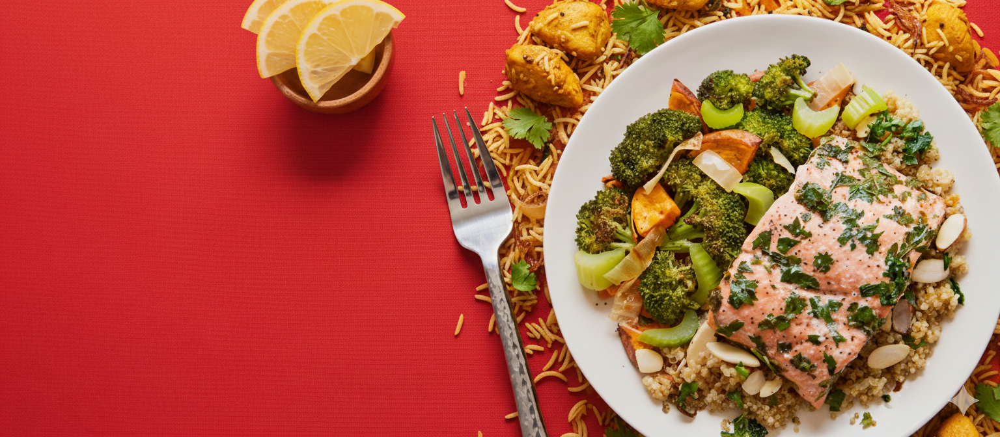

# 🍽️ Foodify - Modern Food Delivery Application


A modern, responsive food delivery web application built with React and Vite. Foodify provides a seamless experience for browsing, ordering, and managing food deliveries with an intuitive user interface and comprehensive cart management system.

## 🖼️ Application Screenshots

### 🏠 Homepage

*Beautiful hero section with compelling call-to-action and food showcase*

### 🍽️ Menu Categories
   
*Interactive category navigation: Salad, Rolls, Desserts, Sandwich, Cake, Pure Veg, Pasta, Noodles*

### 🍕 Featured Food Items
   
*High-quality food photography showcasing our delicious menu items*

### 🛒 Shopping Cart Interface
  
*Intuitive cart management with add/remove functionality*

### 📱 Mobile App Download
 
*Download our mobile app for iOS and Android*

### 🌟 More Food Categories
   
*Diverse menu featuring cakes, pasta, noodles, and vegetarian options*

## 🌟 Features

### 🏠 **Homepage Experience**
- **Hero Section**: Eye-catching landing page with compelling call-to-action
- **Menu Exploration**: Interactive category-based food browsing (Salad, Rolls, Desserts, Sandwich, Cake, Pure Veg, Pasta, Noodles)
- **Food Display**: Beautiful grid layout showcasing top dishes with ratings and pricing
- **App Download**: Promotional section for mobile app downloads

### 🛒 **Shopping Cart & Order Management**
- **Dynamic Cart**: Real-time cart updates with item management
- **Quantity Control**: Add/remove items with intuitive controls
- **Price Calculation**: Automatic subtotal, delivery fee, and total calculations
- **Promo Code Support**: Built-in promotional code system
- **Cart Persistence**: Items maintained across page navigation

### 📋 **Order Processing**
- **Delivery Information**: Comprehensive form for customer details
- **Form Validation**: Client-side validation for all required fields
- **Order Summary**: Detailed breakdown of cart contents and pricing
- **Checkout Flow**: Seamless transition from cart to order placement

### 🎨 **User Interface**
- **Responsive Design**: Mobile-first approach with desktop optimization
- **Modern Aesthetics**: Clean, professional design with consistent branding
- **Interactive Elements**: Smooth animations and hover effects
- **Accessibility**: User-friendly navigation and form interactions

## 🛠️ Technology Stack

- **Frontend Framework**: React 19.1.1
- **Build Tool**: Vite 7.1.7
- **Routing**: React Router DOM 7.9.2
- **State Management**: React Context API
- **Styling**: CSS3 with modern features
- **Development**: ESLint for code quality

## 📁 Project Structure

```
src/
├── components/           # Reusable UI components
│   ├── AppDownload/     # Mobile app promotion
│   ├── ExploreMenu/     # Category navigation
│   ├── FoodDisplay/     # Food items grid
│   ├── FoodItem/        # Individual food card
│   ├── Footer/          # Site footer
│   ├── Header/          # Hero section
│   └── Navbar/          # Navigation bar
├── context/             # Global state management
│   └── StoreContext.jsx # Cart and app state
├── pages/               # Main application pages
│   ├── Cart/           # Shopping cart page
│   ├── Home/           # Homepage
│   └── PlaceOrder/     # Order placement
├── assets/              # Images and static resources
└── main.jsx            # Application entry point
```

## 🚀 Getting Started

### Prerequisites
- Node.js (version 14 or higher)
- npm or yarn package manager

### Installation

1. **Clone the repository**
   ```bash
   git clone <repository-url>
   cd frontend
   ```

2. **Install dependencies**
   ```bash
   npm install
   ```

3. **Start development server**
   ```bash
   npm run dev
   ```

4. **Open your browser**
   Navigate to `http://localhost:5173` to view the application

### Available Scripts

- `npm run dev` - Start development server
- `npm run build` - Build for production
- `npm run preview` - Preview production build
- `npm run lint` - Run ESLint

## 🎯 Key Features Implementation

### State Management
The application uses React Context API for global state management, handling:
- Cart items and quantities
- Food menu data
- Add/remove cart functionality

### Routing
React Router DOM enables seamless navigation between:
- Home page (`/`)
- Shopping cart (`/cart`)
- Order placement (`/order`)

### Form Handling
Comprehensive form validation for delivery information including:
- Personal details (name, email, phone)
- Address information (street, city, state, zip, country)
- Real-time validation with user feedback

## 🎨 Design Highlights

- **Color Scheme**: Red primary color with white backgrounds and dark gray text
- **Typography**: Clean, readable fonts with proper hierarchy
- **Layout**: Grid-based responsive design
- **Images**: High-quality food photography for visual appeal
- **Icons**: Consistent iconography throughout the interface

## 📱 Responsive Design

The application is fully responsive and optimized for:
- Mobile devices (320px and up)
- Tablets (768px and up)
- Desktop screens (1024px and up)

## 🔧 Customization

### Adding New Food Items
Edit `src/assets/assets.js` to add new food items to the `food_list` array:

```javascript
{
    _id: "33",
    name: "New Dish",
    image: food_33,
    price: 25,
    description: "Delicious new dish description",
    category: "Category"
}
```

### Modifying Categories
Update the `menu_list` array in `src/assets/assets.js` to change food categories.

## 🚀 Deployment

1. **Build the application**
   ```bash
   npm run build
   ```

2. **Deploy the `dist` folder** to your preferred hosting service (Vercel, Netlify, etc.)

## 🤝 Contributing

1. Fork the repository
2. Create a feature branch (`git checkout -b feature/amazing-feature`)
3. Commit your changes (`git commit -m 'Add some amazing feature'`)
4. Push to the branch (`git push origin feature/amazing-feature`)
5. Open a Pull Request

## 📄 License

This project is licensed under the MIT License - see the LICENSE file for details.

## 📞 Contact

- **Phone**: +91 9845279245
- **Email**: Foodify@gmail.com
- **Social Media**: 
    

## 🎨 UI Elements & Icons

   
*Comprehensive icon set for enhanced user experience*

---

**Foodify** - Delivering fresh and delicious food with the power of modern web technology! 🍽️✨
